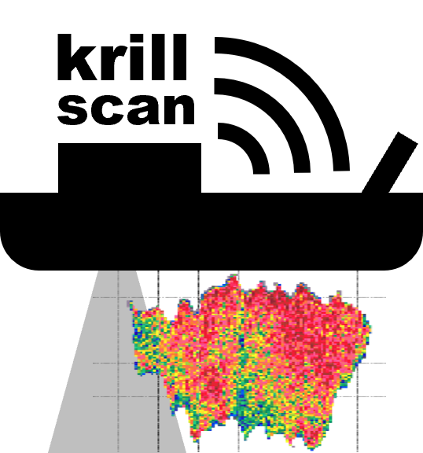
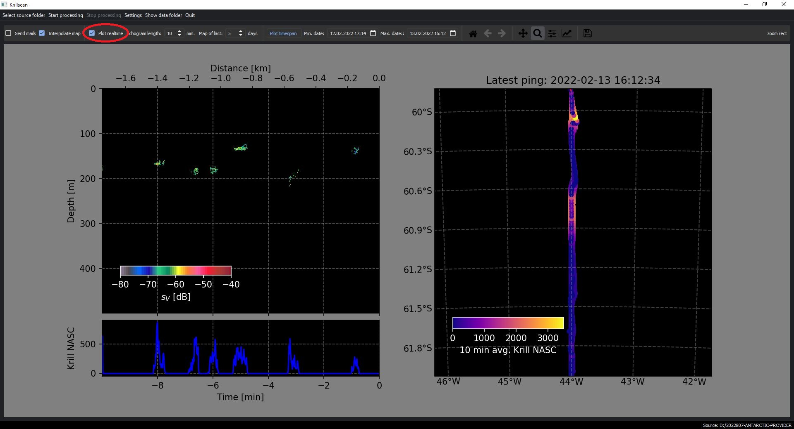
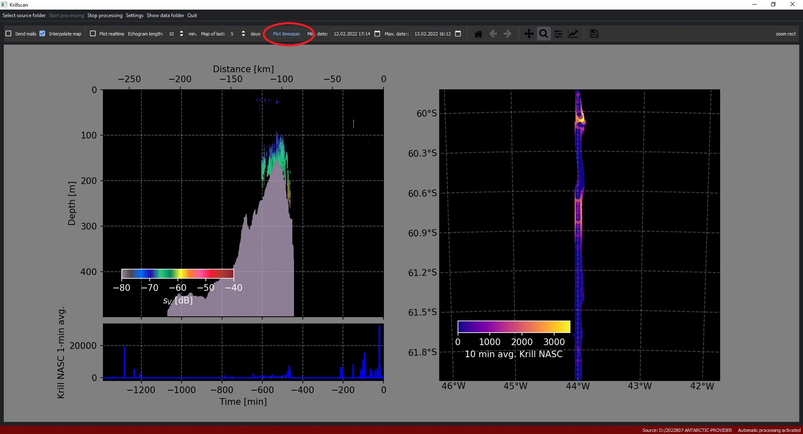
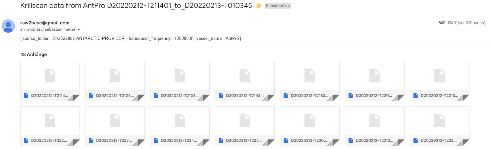

# Krillscan

- Automatically process and analyze EK60 and EK80 echosounder data to detect krill swarms
- Visualize detected krill swarms in real time or manual mode
- Automatically send real time krill swarm data via email 

## Installation

Krillscan was written in python 3.6 and can be run from the source code or as compiled executable. We added the compiled **krillscan.exe** to the latest distribution in this repository.  

## Operation:

Start the program, than:

- Select which folder to scan for .raw files using the button on the upper left

- The default setting is to use the 120 kHz echosounder, if you want to change this:

  - go to "settings" and "edit" and change "transducer_frequency" to your choice
  - adjust the other setting to your choice and save the file

```
[GENERAL]
source_folder = D:/2022807-ANTARCTIC-PROVIDER
transducer_frequency = 120000.0
vessel_name = AntPro

[GRAPHICS]
sv_min = -80
sv_max = -40

[EMAIL]
email_from = myemail@gmail.com
email_to = targetemail1@gmail.com, targetemail1@gmail.com
pw = ***************
files_per_email = 24
send_echograms = True
echogram_resolution_in_seconds = 60
```

    - Press "Start processing" to scan for old and new .raw files and analyze them
    - To watch the processing, or watch incoming data in near real-time (10-min steps) tick the checkbox called "Plot realtime"
    - To plot data from a specific timespan use the "Plot timestamp button"
    - You can zoom in both plots, the location of the echogram is shown as red line in the map








- To let the program automatically send mails with the krill swarm data tick the checkbox called "Send mails"
- You can choose to just send the Nautical area scattering coefficient (NASC) data for the swarms, or avg. of the echograms. The data is compressed into the HDF-5 format, here is an example:

```
                               lat        lon  ...  bottomdepth_m        nasc
ping_time                                      ...                           
2022-02-13 15:52:37.712 -59.871971 -43.997839  ...          499.5    0.000000
2022-02-13 15:52:38.724 -59.871929 -43.997820  ...          499.5    0.000000
2022-02-13 15:52:39.714 -59.871881 -43.997802  ...          499.5    0.000000
2022-02-13 15:52:40.712 -59.871845 -43.997801  ...          499.5    0.000000
2022-02-13 15:52:41.712 -59.871801 -43.997821  ...          499.5    0.000000
                           ...        ...  ...            ...         ...
2022-02-13 16:02:31.713 -59.851249 -44.004235  ...          499.5   10.013148
2022-02-13 16:02:32.712 -59.851223 -44.004242  ...          499.5   31.948985
2022-02-13 16:02:33.724 -59.851197 -44.004267  ...          499.5  166.062586
2022-02-13 16:02:34.713 -59.851174 -44.004299  ...          499.5  376.367236
2022-02-13 16:02:35.712 -59.851156 -44.004327  ...          499.5  635.794869

[599 rows x 5 columns]
```

An email will contain meta data from the sending vessel and the hdf file as attachments:

