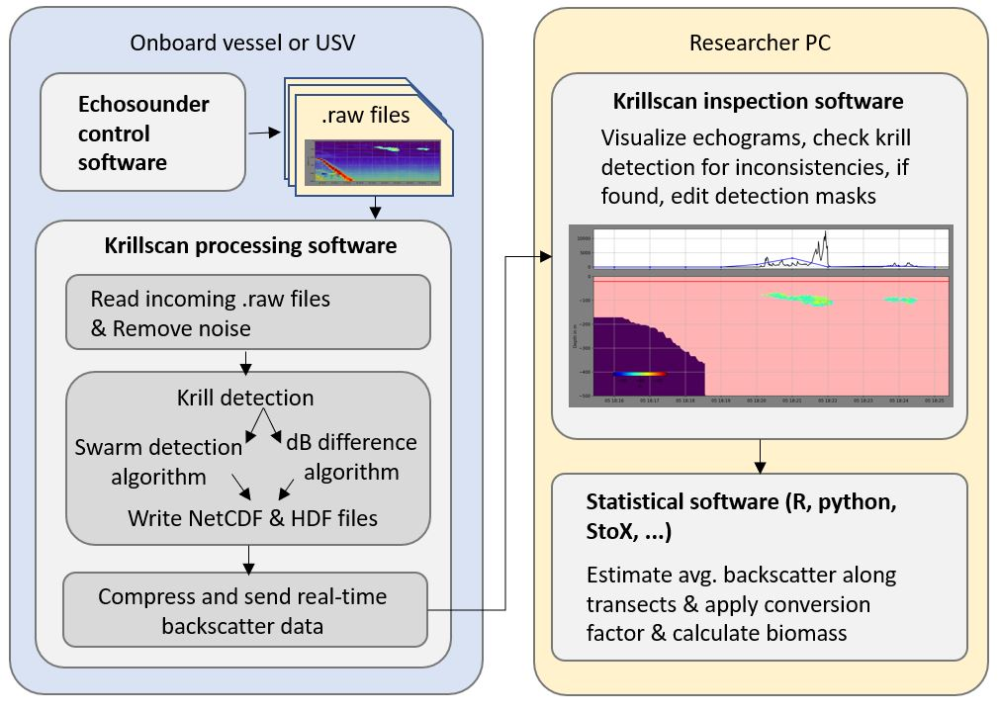
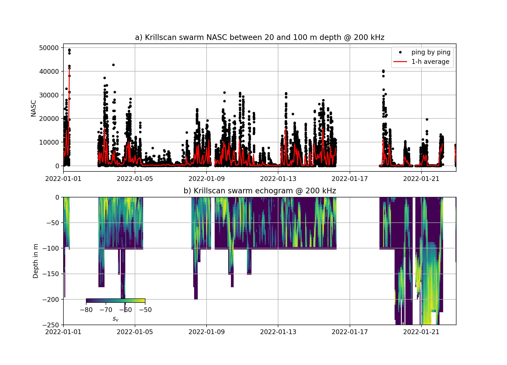
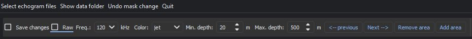
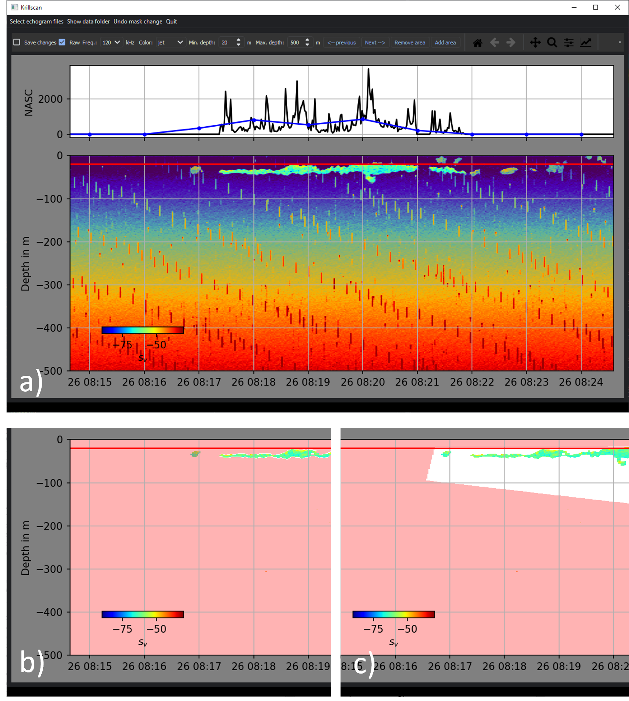
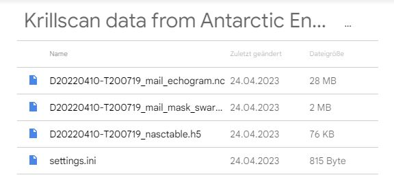

# Krillscan - A python module for automatic analysis of backscatter data from fishing vessels to implement feedback management of the Antarctic krill fishery

- Automatically processes and analyzes EK60 and EK80 echosounder data 
- stores echograms and NASC tables as NetCDF, HDF or .csv files
- detects krill swarms and can send near-real-time acoustic registrations via email



## Installation

Krillscan was written in python 3.9 and can be run from the source code, from inside a docker container or as compiled executable. To download the krillscan module with python try:
```python
pip install krillscan
```

## Operation

### Automatic processing

Here I describe how to operate krillscan from inside python, instructions for the docker container are found below. After opening a python prompt and installing krillscan, you need to create or download a settings.ini file that tells krillscan where to look for incoming files and where to store processed data and contains processing and data transfer parameters. The file should be a text files following this pattern: 

```
[GENERAL]
source_folder = E:\Endurance\2022\raw
target_folder = E:\Endurance\2022\krillscan
scrutinization_frequency = 200000.0
vessel_name = Antarctic Endurance

[CALIBRATION]
gain = None
sa_correction = None
beam_width_alongship = None
beam_width_athwartship = None
angle_offset_alongship = None
angle_offset_athwartship = None

[PROCESSING]
sv_SNR_threshold_db = 3
swarm_sv_threshold_db = -70
dbdiff_sv_threshold_db = 3
seafloor_offset_m= 10
seafloor_sv_threshold_db= -38
surface_exclusion_depth_m = 20
maximum_depth_m = 250
write_mask_as_csv= False

[EMAIL]
email_send = 0
email_from = *Enter a mail address here*
email_to = *Enter a mail address here*
pw = *Enter IMAP password address here*
files_per_email = 6
send_echograms = 1
echogram_resolution_in_seconds = 1
```

This location of the settings.ini file must be passed to krillscan when starting the processing. To send emails set email_send=1 (or True).

To start the processing type:

```python
from krillscan import process
process.ks.start('settings.ini')
# to stop the processing: 
# process.ks.stop( )
```
This starts two threads, one that looks for new data, processes and stores it and another that scans for recently processed data and sends them out via email. This is an ad-hoc solution so far, future versions of krillscan will transfer data directly to a cloud storage. 


### Output format

Krillscan will store the raw and processed echograms, detection masks and NASC tables in 10-min long snippets, with the filename containing the start date of each snippet:


```
D20140125-T060417_echogram.nc
D20140125-T060417_mask_dbdiff.h5
D20140125-T060417_mask_swarm.h5
D20140125-T060417_nasctable.csv
D20140125-T060417_nasctable.h5
D20140125-T060417_rawechogram.nc
```

NASC stands for Nautical area backscattering coefficient has the unit m^2 nmi^-2 and is the vertical integral (sum) of volume backscatter normalized to 1x1 nautical mile area:

```python
sv_lin=np.power(10, Sv120sw /10)  
sv_downsampled=  resize_local_mean(sv_lin,[ len(r_new) , Sv120sw.shape[1] ] ,grid_mode =True)
sa =  integrate.trapezoid(sv_downsampled,sv_dep,axis=0)  
nasc =  4*np.pi*1852**2 * sa
```
Here is an example of the contents of the echogram files, they are stored and read using the xarray module:

```python
import xarray as xr
file="D20140125-T055416_rawechogram.nc"
xr_sv = xr.open_dataarray(file)
print(xr_sv)
```
```
<xarray.DataArray (frequency: 2, depth: 1000, time: 427)>
[854000 values with dtype=float32]
Coordinates:
  * time       (time) datetime64[ns] 2014-01-25T05:54:16.770000 ... 2014-01-2...
  * depth      (depth) float64 0.0 0.5 1.0 1.5 2.0 ... 498.0 498.5 499.0 499.5
  * frequency  (frequency) float64 3.8e+04 1.2e+05
```

Here is an example of the contents of the mask files, they are stored and read as pandas DataFrames. if you want the mask files as csv in addition to hdf you must change settings.ini to "write_mask_as_csv= True". 

```python
import pandas as pd
file="D20140125-T060417_mask_swarm.h5"
df = pd.read_hdf(file,key='df')
print(df)
```
```
2014-01-25 06:04:17.003  False  False  False  False  ...  False  False  False  False
2014-01-25 06:04:18.405  False  False  False  False  ...  False  False  False  False
2014-01-25 06:04:19.807  False  False  False  False  ...  False  False  False  False
2014-01-25 06:04:21.209  False  False  False  False  ...  False  False  False  False
2014-01-25 06:04:22.611  False  False  False  False  ...  False  False  False  False
                       ...    ...    ...    ...  ...    ...    ...    ...    ...
2014-01-25 06:14:09.135  False  False  False  False  ...  False  False  False  False
2014-01-25 06:14:10.537  False  False  False  False  ...  False  False  False  False
2014-01-25 06:14:11.949  False  False  False  False  ...  False  False  False  False
2014-01-25 06:14:13.351  False  False  False  False  ...  False  False  False  False
2014-01-25 06:14:14.753  False  False  False  False  ...  False  False  False  False

[427 rows x 1000 columns]
```
Here is an example of the contents of the NASC tables, they are stored and read as pandas dataframes:

```python
import pandas as pd
file="D20140125-T055416_nasctable.h5"
df = pd.read_hdf(file,key='df')
print(df.columns)
print(df)
```
```
Index(['lat', 'lon', 'distance_m', 'bottomdepth_m', 'nasc_swarm',
       'nasc_dbdiff', 'nasc_manual'],
      dtype='object')
                               lat        lon  ...  nasc_dbdiff  nasc_manual
ping_time                                      ...                          
2014-01-25 05:54:16.770        NaN        NaN  ...    68.604281          0.0
2014-01-25 05:54:18.172        NaN        NaN  ...   188.157065          0.0
2014-01-25 05:54:19.574 -60.010743 -48.319883  ...   223.696955          0.0
2014-01-25 05:54:20.976 -60.010727 -48.320011  ...    89.158265          0.0
2014-01-25 05:54:22.378 -60.010712 -48.320137  ...     0.000000          0.0
                           ...        ...  ...          ...          ...
2014-01-25 06:04:08.591 -60.004068 -48.374217  ...     0.000000          0.0
2014-01-25 06:04:09.993 -60.004052 -48.374346  ...   704.198641          0.0
2014-01-25 06:04:11.395 -60.004037 -48.374469  ...   334.853738          0.0
2014-01-25 06:04:12.797 -60.004021 -48.374597  ...  1719.993121          0.0
2014-01-25 06:04:14.199 -60.004004 -48.374726  ...     0.000000          0.0

[427 rows x 7 columns]
```

Here is an example for 1-month of echosounder data from a krill fishing vessel, processed entirely automatic using the swarm detection method.




### Visual inspection of processed echograms

Krillscan also contains a GUI tool (PyQT5) that lets you inspect the automatically processed echograms and correct the swarm detection masks by adding or removing areas. To start the GUI enter:

```python
from krillscan import inspect
inspect.gui()
```

The GUI looks like this: A  menu bar lets you open processed NetCDF files, show the data folder, undo changes and quite the GUI. The Main window shows the echogram for each 10-min long NetCDF and the ping-by-ping NASC (black line) and 1-min NASC average (blue line). 



The tool bar below the menu bar has these functions:

- Choose which frequency channel to watch
- Tick box that lets you check whether to just browse that data or save changes. Whenever you close a 10-min snippet by clicking "next" or "previous" section a new detection mask is stored as HDF file  with the ending "...mask_manual.h5". And the column "nasc_manual" is added to the nasc table file "...nasctable.h5". 
- You can toggle weather to watch the raw or processed echogram
- You can set the lower and upper NASC integration boundaries, and color scheme
- You can go forward or backward in the dataset by pressing next (or press right arrow) or previous (or press left arrow), this opens the next 10-min echogram NetCDF and detection mask

- You can add or remove areas of the detection mask (shown as red overlay) using double clicks to draw a polygon of you choice. Once finished with drawing press enter to apply the change and update the NASC accordingly.




### Data Transfer

So far I have implemented simple email sending as data transfer method. The echogram NetCDF and detection mask Hdf files are down sampled in time to a desired resolution (in setting.ini) and than compressed into a zip file. This is rather efficient, for a 10-min snippet in 1-s resolution the files echogram files are between 10-30 MB (depending on the number of frequencies) but the zip file is only around 800 kB. In addition to the echogram and mask the ping-by-ping NASC table is sent as Hdf file and the setting.ini file. Here is an example:



You can open and edit these echogram / detection mask files with the inspection GUI, but the "view raw" mode will not work. 

### Parallel post-processing of data

If you have a lot of raw files that need to be processed, it can be better to use parallel processing instead of the serial real-time processing. This is also implemented in krillscan using the multiprocessing module This will process and store the data in their original file length and not 10-min snippets. To start the parallel post-processing you can use the same ini file, the module will detect the amount of cores available and distribute tasks across all of them.

```python
from krillscan import process
process.ks.start_para_processing('settings.ini')
```


## Acknowledgements

This software relies on packages and functions developed by the rapidkrill, echopy, pyecholab and echopype projects. We would like to thank the teams for sharing their useful code! We also thank all developers of python and its many open libraries. 

https://github.com/bas-acoustics/rapidkrill

https://echopype.readthedocs.io/en/stable/index.html

https://github.com/bas-acoustics/echopy

https://github.com/CI-CMG/pyEcholab/tree/master/echolab2


